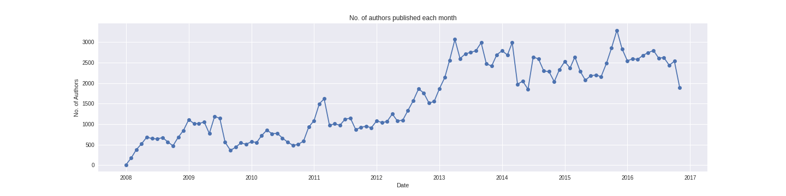

# Eluvio_DS_Challenge
## Dataset Description
- Total Samples: 509236
- Start date: 1/25/2008, End Date: 11/22/2016.
- Features: time_created, date_created, up_votes, down_votes, title, over_18, author, category
- Total number of articles published each year

- Total number of articles published monthly

- Total number of authors published monthly

###Libraries Used
- pandas: Used for data manipulation and analysis
- NumPy: Used for handling multi-dimensional arrays and matrices
- nltk: Used for Natural Language preprocessing
- fastText: Used for learning word embeddings and text classification which is created by Facebook's AI team
- faiss: Used for efficient similarity search and clustering of word embeddings
## Recommendation

## Search and Ranking
